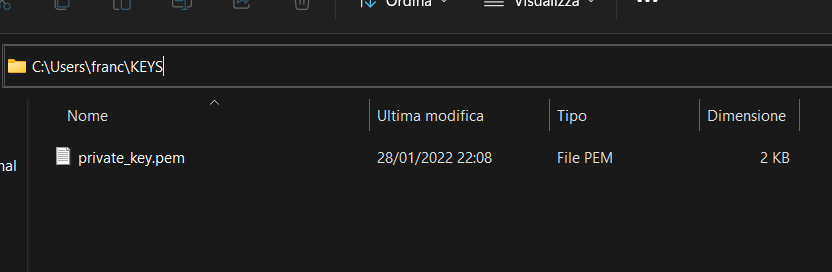
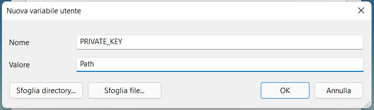
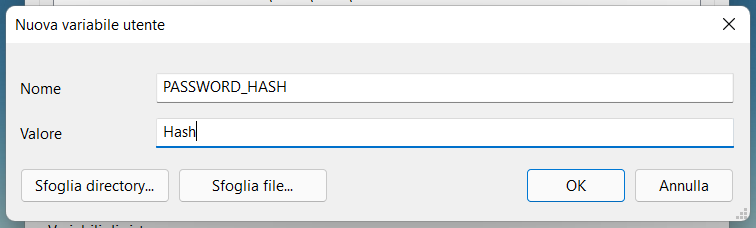

# Cryptographied Password Manager
Cryptographied Password Manager is a tool for storing Encrypted Passwords in your Local machine. 

## Set Up
Download the ZIP Folder, or Clone the Repository with:
```
git clone https://github.com/TonicStark/Cryptographied-Password-Manager.git
```

Then install the dependencies in a virtualenv, you can create one via `python -m venv <name of the virtualenv>`, with:
```
pip install -r requirments.txt
```

Now, you need to run the `keys.py` file and then **DELETE** it. This file will populate the `public_key.pem`, `private_key.pem` and `pwd_hash.pem` files with personalized text. The first two are your **Public**, **Private Keys**; the third one is the password you've inserted, hashed.

The `public_key.pem` can be public so you can keep it in this folder. The `private_key.pem` mustn't be public. **DON'T MAKE IT PUBLIC** because this is the only way you have to decrypt YOUR passwords. Is the only way to reverse the process.

If you try to access the database in other ways, you can see that the passwords are stored in an encrypted way.

## Personalization
Now, copy the `private_key.pem` file and paste it into a folder difficult to find, maybe a folder in your User or something else. Copy the path to the file, for example:



In this specific case, the path will be `C:\Users\franc\KEYS\private_key.pem`. Write this somewhere because we will need this forward in the Set Up. Delete the copy of the `private_key.pem` file from this folder.

Now open the `pwd_hash.pem` file, copy the hashed version of the password you inputted and write it somewhere the same as the Private Key.

Now we have 2 variants: if you are on Windows or in a Unix-based System (Linux or Mac).

### Windows
Navigate to `Control Panel > System and Security > System > Advanced System Settings`. Now in Advance System Setting click on `Environment Variables`.
Here we can add new user variables and new system variables. We will add user variables by clicking `New` under user variables.

In the new window, you can add `Variable Name` and `Variable Value` and click ok.

Now, take the path of the `private_key.pem` file and save it as **PRIVATE_KEY**, in this way:



The same thing, you have to do now with the Hash. Take it and store it in an Environment Variable called **PASSWORD_HASH**, in this way:



### Linux or Mac
To set a password or secret keys in the environment variable on Linux (and Mac) you need to modify the `.bash_profile` file that is in your home directory. You need to open the terminal and cd to the home directory.

Now, open the `.bash_profile` file in any text editor of your choice for example, with VS Code:
```
code .bash_profile
```
We need to add our environment variable in this file. For that add the following content at the top of the file.
```bash
export PRIVATE_KEY="Path to the private_key.pem file"
export PASSWORD_HASH="The Hash of the Password"
```

# Start the Program
Now you have only to start the program and you will have a nice command-line interface to store, update and delete your passwords. You can also search your passwords and list them by various Options. Follow the Commands' instructions and you won't face any problems. **Happy Encryption!**