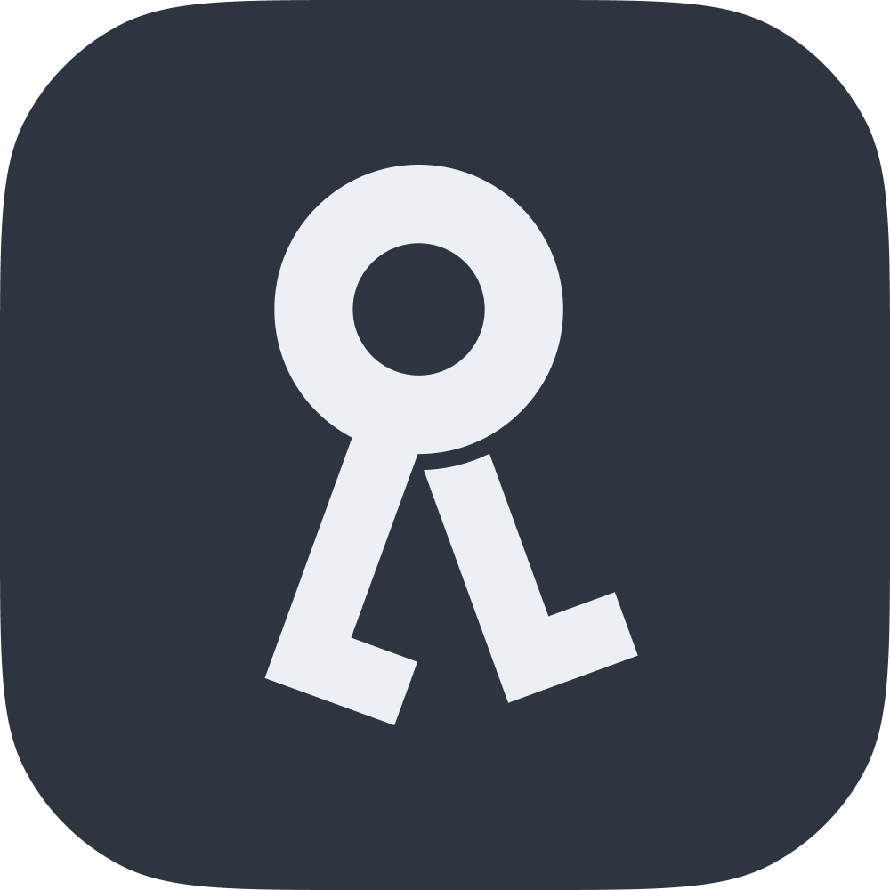

<div align="center">
  
  <h1>Lock: A Local UI-Based Password Manager</h1>
</div>

<p align="center">
  <a href="https://buymeacoffee.com/saccofrancesco">
    
  </a>
</p>

<h4 align="center">A cross-platform, secure, and beautifully designed password manager — built with <a href="https://customtkinter.tomschimansky.com/" target="_blank">CustomTkinter</a> and powered by strong encryption.</h4>

<p align="center">
  
  
  
  
</p>

<p align="center">
  <a href="#tldr">TL;DR</a> •
  <a href="#key-features">Key Features</a> •
  <a href="#download-latest-release">Download</a> •
  <a href="#quickstart">Quickstart</a> •
  <a href="#credits">Credits</a> •
  <a href="#license">License</a>
</p>

<div align="center">
  
</div>

---

## 📌 TL;DR
**Lock** is a local password manager with a sleek CustomTkinter GUI.  
It encrypts all your credentials with a master password, so you only need to remember **one password to access them all**.  
Simple, reactive, and cross-platform — security made user-friendly.

---

## 💡 Why Lock Stands Out
- **Minimal setup** – just run and start managing passwords  
- **Secure by design** – AES encryption tied to your master password  
- **Smooth UI** – reactive CustomTkinter interface with password-hiding features  
- **Curated visuals** – themed with the elegant [Nord color palette](https://www.nordtheme.com/docs/colors-and-palettes)  
- **Cross-platform** – works on Windows, macOS, and Linux  

---

## 🔑 Key Features
* **Simple GUI** – Start the app and you’re ready to go.  
* **Reactive UI** – Every action instantly updates the interface.  
* **Password Safety** – Hide input while typing and store securely.  
* **Design Principles** – “Remember one password, access all.”  
* **Strong Encryption** – Each credential is encrypted with your master password.  
* **Cross-Platform** – Works across major OSes.  

---

## ⬇️ Download Latest Release

Use these links to download the **latest published release asset** directly:

| Platform | Architecture | Direct download |
|---|---|---|
| Windows | x64 | [lock-windows-x64.zip](https://github.com/saccofrancesco/lock/releases/latest/download/lock-windows-x64.zip) |
| macOS | Intel (x64) | [lock-macos-intel.zip](https://github.com/saccofrancesco/lock/releases/latest/download/lock-macos-intel.zip) |
| macOS | Apple Silicon (arm64) | [lock-macos-arm64.zip](https://github.com/saccofrancesco/lock/releases/latest/download/lock-macos-arm64.zip) |
| Linux | x64 | [lock-linux-x64.zip](https://github.com/saccofrancesco/lock/releases/latest/download/lock-linux-x64.zip) |
| Linux | arm64 | [lock-linux-arm64.zip](https://github.com/saccofrancesco/lock/releases/latest/download/lock-linux-arm64.zip) |

These URLs always target the latest release, so they stay valid after each new `v*` tag.

---

## ⚡ Quickstart

To clone and run Lock, you’ll need [Git](https://git-scm.com) and [Python](https://www.python.org/downloads/).

```bash
# Clone this repository
git clone https://github.com/saccofrancesco/lock.git
cd lock

# Install dependencies
pip install -r requirements.txt

# Run the app
python main.py
```

---

## 📬 Emailware: Share Your Thoughts

Lock is [emailware](https://en.wiktionary.org/wiki/emailware).
If this app helps you, I’d love to hear from you!

Send feedback to: **[francescosacco.github@gmail.com](mailto:francescosacco.github@gmail.com)**

---

## 🙏 Love Lock? Support It!

If you enjoy this project:

* ⭐️ Star the repo
* 🧃 [Buy me a coffee](https://www.buymeacoffee.com/saccofrancesco)
* 💌 Share your thoughts by email

---

## 🧠 Credits & Acknowledgements

Lock uses the following great libraries:

* [Python](https://www.python.org/)
* [CustomTkinter](https://customtkinter.tomschimansky.com/)
* [Cryptography](https://github.com/pyca/cryptography)
* [Nord Theme](https://www.nordtheme.com)

---

## 📎 You Might Also Like...

Check out more by the same author:

* [Supremebot](https://github.com/saccofrancesco/supremebot): A Supreme bot built with [Streamlit](https://streamlit.io/).
* [Crosswords](https://github.com/saccofrancesco/crosswords): Crossword solver powered by [Streamlit](https://streamlit.io/) and [Tesseract OCR](https://github.com/tesseract-ocr/tesseract).

---

## 📜 License

This project is licensed under the [MIT License](https://opensource.org/licenses/MIT) — feel free to use it in your own projects!

---

> GitHub [@saccofrancesco](https://github.com/saccofrancesco)
